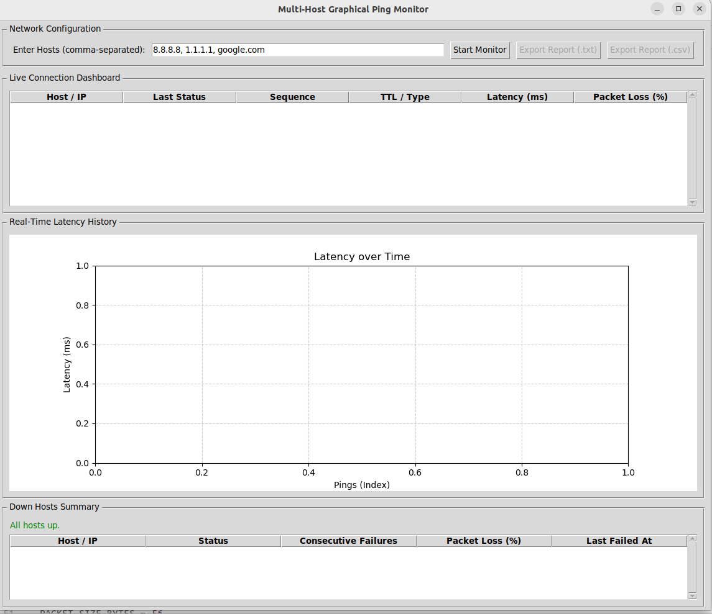

# ping_monitor
A ping monitor python code that include graphical interface, to check hosts availability. 

# change the default Ping parameter, like packet size and ping interval
# currently, both are in the default value. 
Undert class PingMonitorApp:
  PACKET_SIZE_BYTES = 56
    PING_INTERVAL_SECONDS = 1.0

# Export the result. 
Export Report botton 

# Hosts are seperated by comma, between comma can have mutiple "space", but not support like 192.168.1.1-254 or 10.168.1.0/24 

